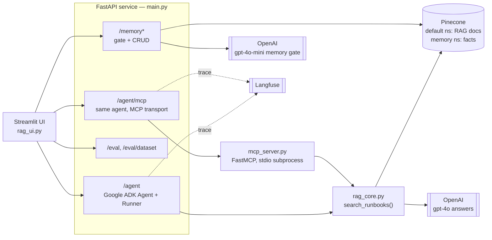

# Week 1 — `/ask` Demo (5 stages)

Build a typed LLM endpoint step by step. Each stage is a standalone FastAPI app you can run and compare. `main.py` is stage 5 grown into the actual capstone described below.

## Capstone: on-call incident triage agent

A case study, in order: **problem → architecture → stack → evals → memory.** Should take under two minutes to read, or ninety seconds to say out loud.

**Live:** UI [ai-internship-streamlit-ui.onrender.com](https://ai-internship-streamlit-ui.onrender.com) · API [ai-internship-5euv.onrender.com](https://ai-internship-5euv.onrender.com) · [source](https://github.com/dol7/AI-Internship)

### Problem

When something breaks in production, the on-call engineer's first move is usually "has this happened before, and what fixed it?" — but that answer is scattered across old internal documents and whoever happens to remember the last incident. This agent answers on-call questions grounded in the team's own incident history, tells you which document it used, refuses to make up an answer when it doesn't have one, and remembers standing instructions across sessions instead of asking again every time.

### Architecture



In words: a question comes in through the UI → the **agent** decides for itself whether it needs to search anything, and how many times → the **tool** it can call searches the runbook/postmortem knowledge base and returns a cited answer → a separate, small **memory** store handles standing facts (write/read/forget) through its own gated path, untouched by the retrieval logic above → every request on either path is traced end to end.

### Stack

FastAPI + Google ADK (`Agent`, `Runner`, `InMemorySessionService`) for the agent loop; OpenAI structured outputs (`chat.completions.parse` + a Pydantic `Answer` schema) for grounded generation; Pinecone for both the RAG knowledge base and the durable memory store (separate namespaces); MCP (`FastMCP`, stdio + streamable-HTTP transports) as an alternate tool-calling path into the same retrieval core; Langfuse (`GoogleADKInstrumentor` + `langfuse.openai`) for tracing both transports; Streamlit as a thin client — no business logic lives in the UI; deployed on Render (API and UI as two separate free-tier services).

### Evals

Open-coded 20 sample traces plus 15+ of my own capstone runs into a failure taxonomy (4+ categories), ranked by frequency × impact. Top failure: the agent would sometimes assert `sources_needed=true` but attach citations inconsistently — a real grounding gap, not a cosmetic one. Two rounds of prompt-only fixes (a checklist, then a stricter two-gate rewrite) each measurably improved but did not eliminate it. Shipped a deterministic code-level fix instead — `rag_core.py`'s `call_rag_structured` now force-clears citations whenever `sources_needed=True` fails its own consistency check, rather than trusting the model to self-police. Re-running the same 13 real questions: with the guard disabled (`DEMO_DISABLE_CITATION_GUARD=true`, i.e. the old prompt-only behavior), `sources_needed_citation_consistency` landed at 54–69% (7–9 / 13) across runs — genuine LLM sampling variance, not cherry-picked. With the guard on (shipped default), it is **13/13 (100%)**, confirmed on every run since, including a fresh check today.

Full story with the before/after screenshots: [BLOG_POST.md](BLOG_POST.md) ([designed version](https://claude.ai/code/artifact/6f1986d4-70ea-4ac3-a2aa-d56b7d9ff242)).

### Memory

- **What:** stable corrections, preferences, and last-successful-fix notes — never raw tool output.
- **When:** on an explicit write, or through a gate that discards one-off questions and keeps only durable facts.
- **Where:** a dedicated Pinecone namespace, not local disk (Render wipes local disk on every restart).
- **How:** plain key/value fetch — no similarity search, no ambiguity about what comes back.
- **Forgetting:** only on an explicit delete — no auto-expiry yet, so today it's a human decision.

Full walkthrough (CLI, curl, Streamlit tab): [§ Durable memory](#durable-memory) below.

## Setup

```bash
cp .env.example .env          # OPENAI_API_KEY=sk-...
python -m venv .venv
source .venv/bin/activate
pip install -r requirements.txt
```

## Demo stages

| Stage | File | What you learn |
|-------|------|----------------|
| 1 | `serve_stage1.py` | Bare `/ask` — string answer + `tokens_used` |
| 2 | `serve_stage2.py` | Structured output via Pydantic + `completions.parse` |
| 3 | `serve_stage3.py` | Validation guardrail + retry (`force_bad` demo knob) |
| 4 | `serve_stage4.py` | Per-request `model` override + `latency_ms` |
| 5 | `serve_stage5.py` / `main.py` | Full system + `cost_usd` readout |

Run one stage at a time (only one server on port 8000):

```bash
uvicorn serve_stage1:app --host 127.0.0.1 --port 8000 --reload
# or the full system:
uvicorn main:app --host 127.0.0.1 --port 8000 --reload
```

## Streamlit demo runner

Interactive UI for all five stages:

```bash
streamlit run demo_page.py
```

Open http://localhost:8501. Set **API base URL** to `http://127.0.0.1:8000` and start the matching stage server in another terminal.

## Test with curl

```bash
curl -s -X POST http://127.0.0.1:8000/ask \
  -H "Content-Type: application/json" \
  -d '{"question": "What is RAG in one sentence?"}'
```

Stage 5 example (model + cost):

```bash
curl -s -X POST http://127.0.0.1:8000/ask \
  -H "Content-Type: application/json" \
  -d '{"question": "What is chunking?", "model": "gpt-4o-mini"}'
```

## Smoke-test all stages

Requires `.venv` and a valid `OPENAI_API_KEY`:

```bash
python test_all_stages.py
```

## Durable memory

The agent has a small human-memory store, separate from its RAG knowledge
base: **what** it keeps is stable corrections, preferences, and
last-successful-fix notes (e.g. "always page the DBA on-call for database
issues"), never ephemeral tool output like raw `search_runbooks()` results,
which is regeneratable and doesn't belong in long-term memory. **When** it
writes: either directly via `PUT /memory/{key}`, or through a gate —
`POST /memory/write-gated` sends free text to a small classifier
(`gpt-4o-mini`) that decides whether it's a durable fact worth keeping or a
one-off question/diagnostic that should just be discarded, and only
persists in the former case. **Where** it lives: a dedicated `"memory"`
namespace in the same Pinecone index the RAG documents already use, not a
file on local disk — Render's free tier wipes local disk on every restart
or redeploy, so a SQLite/JSON file would not actually be durable there.
**How** it's retrieved: `GET /memory/{key}` or `GET /memory` (list all),
both plain key/value fetches, no similarity search involved. **When it's
forgotten:** only on an explicit `DELETE /memory/{key}` — there's no TTL or
auto-expiry yet, so today "forget" is a human decision, not an automatic
one. Try it end-to-end with `memory_cli.py` (talks to the deployed API by
default, so a write from one process and a read from a completely separate,
later process is a real cross-session test, not just an in-memory demo):

```bash
python memory_cli.py write db-issues-escalation "Page the DBA on-call for database issues, not general platform on-call." --category escalation_rule
python memory_cli.py read db-issues-escalation
python memory_cli.py gated-write "What's the current error rate on checkout?"   # discarded, not a durable fact
python memory_cli.py list
python memory_cli.py forget db-issues-escalation
```

Or in Streamlit, under the **Memory** tab.

## Project layout

```
week-1/
├── main.py              # Full system (stages 1–5 combined)
├── serve_stage1.py … serve_stage5.py
├── demo_page.py         # Streamlit test UI
├── test_all_stages.py   # Automated stage smoke tests
├── requirements.txt
├── .env.example
└── .gitignore
```
